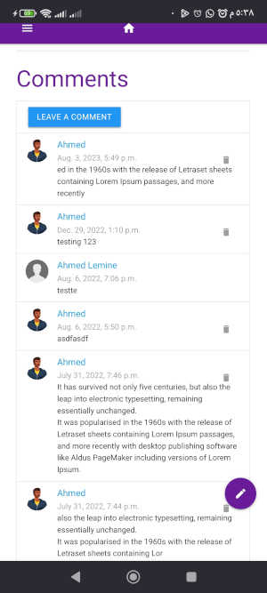
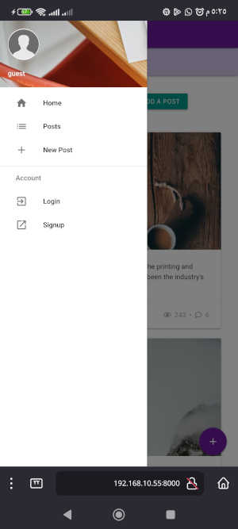

# Django Materialize CSS and HTMx Starter Template
### a simple Django blog with [Materialize CSS](https://materializecss.com/) and [HTMx](https://htmx.org/)


This is a fully functioning mobile-first Django project to use as a starter for your new project.
The fully responsive mobile-first design with a side menu and floating action buttons make the whole site look like an Android app (see screenshots).

A Posts app and Accounts app are setup just as an example to showcase various functionaliy and featuers of the project with several useful packages and settings included like Django-Allauth and Django-Jazzmin.

## Why another Django template?

Most Django templates use Bootstrap. I thought building one with another CSS framework can be of some use to some users who want a different look and feel than the generic Bootstrap templates out there. Also, I couldn't find one and at some point felt I should do it myself.
In addition to the style, HTMx is a very nice library and looks promising so I added just enough HTMx to showcase its beauty with Django.

## Screenshots:


☝🏽 home page on desktop browsers


☝🏽 desktop view for index page as a logged in user.


☝🏽 home page on mobile devices


☝🏽 mobile view for a single post




☝🏽 mobile view for comments under each post




☝🏽 mobile side menu


☝🏽 mobile side menu for logged in user


☝🏽 mobile login page


☝🏽 floating action buttons


☝🏽 floating action buttons on a single post


## Features:

- Materialize CSS gives a Google's Material Design look and feel (Android) for all pages, with floating action buttons.
- Fully responsive and mobile-first design with a side menu that makes the whole site on mobile browser look like an Android app.
- HTMx for posting comments wich allows for updating only the part of the page that shows the new comment. After posting a new comment, a "delete" icon is shown next to it so that it can be deleted and removed from the page, also without reloading the entire page.
- HTMx for loading posts asynchronously in the home page.
- Posts app for publishing blog posts with photos.
- Comments system to allow user to comment on posts.
- Custom user model ready to use. You can add custom fields and properties to users.
- User login/signup with Django-Allauth with all Allauth templates customized to have Materilized CSS style.
- User email/password change with email confirmation.
- User public and private profile with photo and bio and list of posts.
- Flash messages (toasts) that look like Android native flash messages to display info after any user-generated action like "Post has been updated", "You're logged in as User" etc.
- Thumbnails for users avatars and post images using ImageKit.
- Custom error pages like 404, 500.
- Nice-looking admin site using Jazzmin (not Meterialize CSS style).


## Installed Packages:

- django-allauth setup and ready to use with login and profiles.
- django-environ to store senstive settings in a .env file.
- django-hitcount for counting visits to blog posts or any models you wish to add later.
- django-jazzmin for a nicer looking Django admin interface.
- django-materializecss-form to add support for Materialize CSS in Django forms.
- ImageKit to resize images and create thumbnails.


## How to use:

1- Clone repo and cd into its folder:

```
git clone https://github.com/ahmedlemine/django-materialize-css.git
cd django-materialize-css/
```

2- Create a virtual environment:

```
python3 -m venv venv
```

3- Activate virtual env:

```
source venv/bin/activate
```

4- Install requirements

```
pip3 install -r requirements.txt
```

5- Create a .env file, use example.env as an example or just rename it to ".env"

```
mv env.example .env
```

6- Migrate:

```
python3 manage.py migrate
```

7- Create suepr user:

```
python3 manage.py createsuperuser
```

8- Run server

```
python3 manage.py runserver
```

9- Start your own apps (or use the project just as a blog):

```
python3 manage.py startapp my_app
```

👋🏼 **If you find it useful:**

👉🏽 [Buy me a coffee!](https://www.buymeacoffee.com/ahmedlemine) 👈🏽